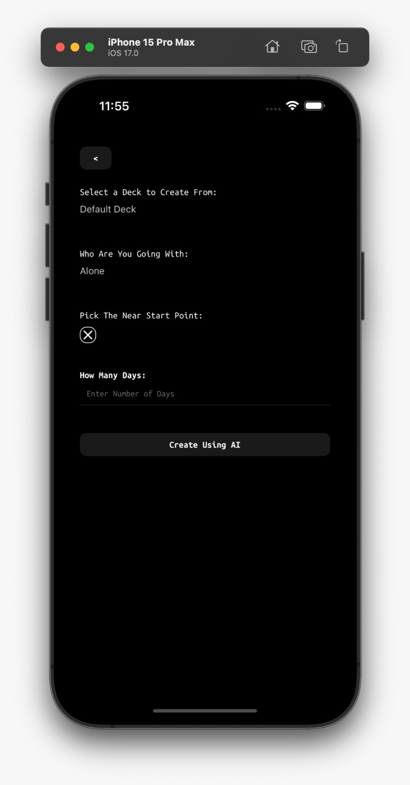

<body style="background: #fff; font-family: Arial, sans-serif; line-height: 1.6;">

# Wayou
The recommender-engine, AI powered route generator.

The project is divided into 4 main parts:
- CenterEnd: The main backend that handles the requests and responses.
- Microservices: The services that are responsible for the AI and the recommendation engine.
- Clients: The clients that are responsible for the user interface.
- Data: The data, fetch and some operations that is related with the AI.

## How to run
Sorry for the inconvenience, but the project is not yet dockerized, so you have to run each part separately.

### Mobile
```sh
cd clients/mobile
npm i
npx expo start
```

### Center End Backend:
```sh
cd backend 
dotnet build
cd CenterEnd/CenterEnd.GatewayApi
dotnet run
```

### For Each MicroService:
```sh
cd backend/Microservices/\[name of the microservice\]
if the microservice powered by flask: python3 pip install python3 src/main.py
if the microservice powered by node: npm install node src/index.js
if the microservice powered by dotnet: dotnet build dotnet run
```

## Some Screenshots
<div style="display: flex; flex-wrap: wrap; justify-content: center;">
    
    
    
    
    
    
</div>

## Backend diagrams
<div style="display: flex; flex-wrap: wrap; justify-content: center;">
    
    
    
</div>

</body>
