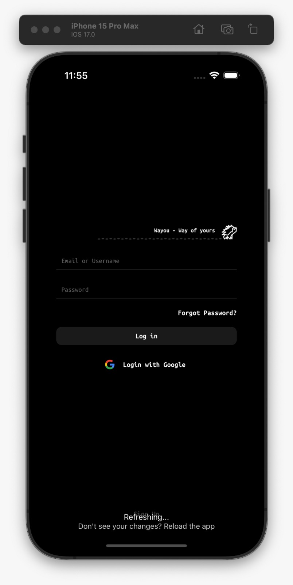

<body style="background: #fff;">

# Wayou
The AI powered route planner for the visually impaired.

## How to run
Mobile:
cd clients/mobile
npm i
npx expo start

Center End Backend:
cd backend 
dotnet build
cd CenterEnd/CenterEnd.GatewayApi
dotnet run

For Each MicroService:
cd backend/Microservices/\[name of the microservice\]
if the microservice powered by flask: cd python3 pip install python3 src/main.py

## Screenshots

## Backend diagrams
### CenterEnd Project 

### Software Architecture

### Request-Response Flow

</body>
